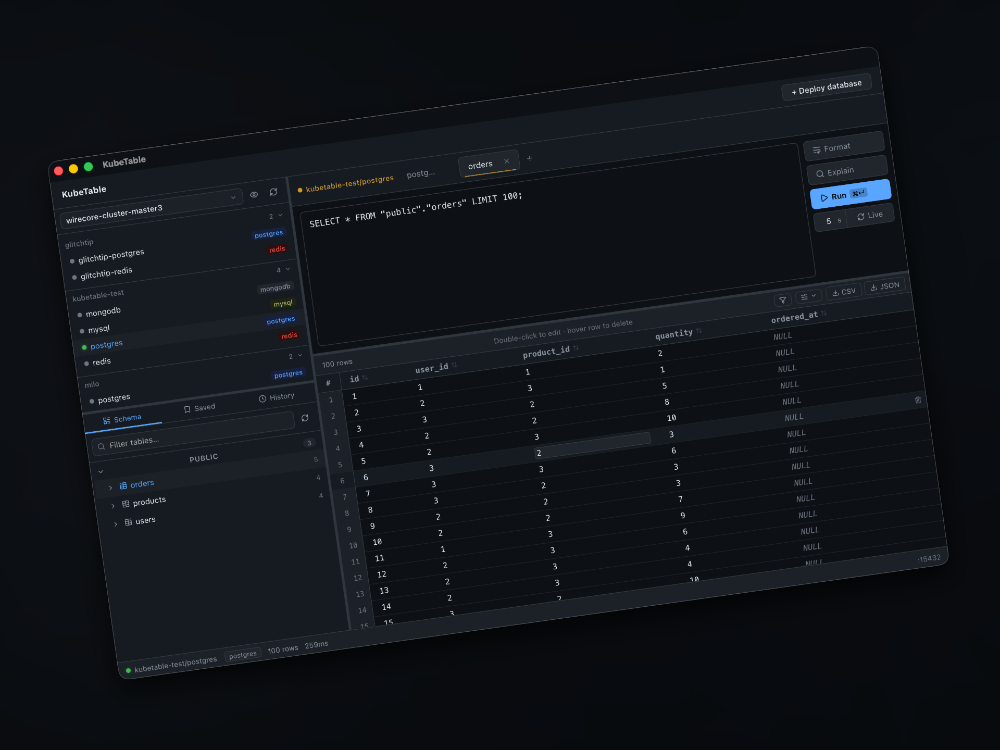

# KubeTable Community

**The local-first database GUI for Kubernetes. Browse Postgres, MySQL, Redis, MongoDB, and CockroachDB inside your clusters without juggling `kubectl port-forward` and a separate SQL client.**

[](LICENSE)
[](https://github.com/kubetable/kubetable/releases)
[](https://github.com/kubetable/kubetable/releases)
[](https://github.com/kubetable/kubetable/stargazers)
[](https://tauri.app)



KubeTable reads your kubeconfig, discovers database services running in your clusters, opens and manages local port-forwards for you, and gives you a full query workspace — schema explorer, SQL editor, result grid, row editing, exports — all in one desktop app. No accounts, no cloud, no telemetry. Your credentials never leave your machine.

---

## Why KubeTable

If you work with databases inside Kubernetes, the daily loop usually looks like this:

```
kubectl get svc -n …    →    kubectl port-forward …    →    psql / mysql / mongosh
```

You end up with stray port-forwards, half a dozen terminal tabs, and a separate database GUI that doesn't know anything about your cluster. KubeTable collapses that into one app:

- **Cluster-aware** — services, namespaces, and credentials are discovered from your kubeconfig
- **Port-forwards as first-class objects** — open, reuse, and close tunnels from the UI
- **One workspace for every database** — same schema explorer, same query editor, same result grid
- **Local-first by design** — no sign-up, no hosted backend, no outbound calls for the core workflow

## Supported Databases

| Database     | Browse | Query | Edit rows | Export |
| ------------ | :----: | :---: | :-------: | :----: |
| PostgreSQL   |   Yes  |  Yes  |    Yes    |   Yes  |
| MySQL        |   Yes  |  Yes  |    Yes    |   Yes  |
| CockroachDB  |   Yes  |  Yes  |    Yes    |   Yes  |
| MongoDB      |   Yes  |  Yes  |    Yes    |   Yes  |
| Redis        |   Yes  |  Yes  |    Yes    |   Yes  |

## Features

- Kubernetes service discovery from local kubeconfig files
- Automatic port-forward lifecycle management
- Multi-tab SQL editor with formatting, history, and saved queries
- Schema explorer for relational and key/document databases
- Result grid with filtering, sorting, pagination, inline row editing
- CSV and JSON export
- Read-only connection mode for safer inspection of production-like environments
- Local cluster source management across multiple kubeconfigs
- Database deploy assistant for spinning up test and development instances
- Ready-to-apply test manifests for Postgres, MySQL, Redis, and MongoDB

## Install

Pre-built desktop bundles for macOS, Windows, and Linux are published on the [Releases page](https://github.com/kubetable/kubetable/releases).

| Platform | Download                                                                              |
| -------- | ------------------------------------------------------------------------------------- |
| macOS    | `.dmg` (Apple Silicon and Intel) — see [latest release](https://github.com/kubetable/kubetable/releases/latest) |
| Windows  | `.msi` — see [latest release](https://github.com/kubetable/kubetable/releases/latest) |
| Linux    | `.AppImage` and `.deb` — see [latest release](https://github.com/kubetable/kubetable/releases/latest) |

You'll also need `kubectl` access to any cluster you want to inspect.

## Privacy and Security

KubeTable Community is designed to run locally:

- No account required
- No hosted telemetry
- No external service dependency for the core desktop workflow

The app does touch sensitive local data — kubeconfigs, cluster metadata, database credentials, SQL text, and query results. Please don't paste real kubeconfigs, credentials, tokens, private keys, production URLs, or screenshots with secrets into issues or pull requests.

Read [docs/SECURITY_MODEL.md](docs/SECURITY_MODEL.md) before changing code that handles kubeconfigs, credentials, query execution, logging, storage, or network behavior. To report a vulnerability, follow [SECURITY.md](SECURITY.md).

## Build from Source

Requirements:

- Bun
- Rust stable
- Platform dependencies required by [Tauri](https://tauri.app/start/prerequisites/)
- `kubectl` for testing against real clusters

```sh
bun install
bun run tauri dev        # run the desktop app in development
bun run build            # build the frontend
bun run tauri build      # build a desktop bundle
```

Check the Rust backend:

```sh
cd src-tauri && cargo check
```

## Test Cluster

The `test/` directory contains a small Kubernetes test environment with sample PostgreSQL, MySQL, Redis, and MongoDB services.

```sh
kubectl apply  -f test/kubetable-test.yaml   # apply
kubectl delete -f test/kubetable-test.yaml   # remove
```

Or use the helper script:

```sh
./test/kubetable-test.sh up
./test/kubetable-test.sh status
./test/kubetable-test.sh down
```

Use only local or disposable clusters for test data.

## Extension Points

The public app exposes a small plugin host for downstream builds:

```tsx
import App from "./App";

export default function Root() {
  return <App plugins={[]} />;
}
```

Plugins can add app-level integrations — telemetry adapters, command-palette actions, topbar actions, cluster-manager sections — without changing Community source code. Keep hosted integrations, release infrastructure, and service-specific credentials outside this repository.

## Repository Layout

```txt
src/                         React desktop UI
src/App.tsx                  App shell and plugin host
src/lib/plugins.ts           Neutral plugin interfaces
src/lib/tauri.ts             Frontend bindings for Tauri commands
src-tauri/                   Tauri app and Rust backend
src-tauri/src/discovery/     Kubernetes discovery and credential detection
src-tauri/src/portforward/   Local tunnel management
src-tauri/src/adapters/      Database adapters
test/                        Kubernetes test environment
docs/                        Security model and release notes
```

## Contributing

We welcome pull requests, bug reports, and feature ideas. Read [CONTRIBUTING.md](CONTRIBUTING.md) and the [Code of Conduct](CODE_OF_CONDUCT.md) before opening a pull request.

Before opening a PR:

```sh
bun run build
cd src-tauri && cargo check
```

If your change affects kubeconfig parsing, credential detection, query execution, local storage, logs, or network behavior, include a short security note in the pull request.

## License

KubeTable Community is licensed under [Apache-2.0](LICENSE).

---

<sub>Keywords: kubernetes database GUI, kubectl port-forward alternative, postgres client for kubernetes, mysql kubernetes client, mongodb kubernetes client, redis kubernetes client, cockroachdb client, local-first database tool, tauri database client, kubernetes developer tools.</sub>
